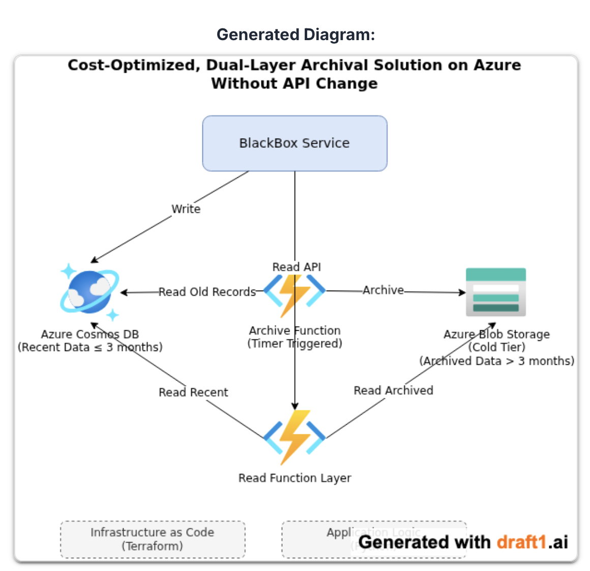

# Symplique_SolutionsDevops_Screening
Solution for https://gist.github.com/vikas-t/724da4a118612a8a8faf0acd5e4e4567
# Actuals:
Azure Cosmos DB, "BlackBox" Service having Read/Write APIs to fetch/store data from Azure Cosmos DB. 
Specs for Azure Cosmos DB :
- Lots of reads.
- Holds more than 2 Million billing records, each record can be around 300 KB.
- Records span many years, but records older than 3 months are rarely accessed.

# Goal & Caveats :
Optimize storage and operational cost keeping these in check :
- Records older than 3 months should be fetched if needed within seconds.
- Simple solution, easy to manage.
- No Data Loss, No Downtime.
- No Changes to Read/Write APIs.

# Approach:
Move records older than 3 months to Azure Blob Storage [Cold Tier] using Azure Functions with Timer Trigger. Introduce a secondary layer behind the Read API which is aware of the dual storage namely Azure Cosmos DB and Azure Blob Storage.

## Implementation :

`code/archivefunctionapp/terraform/main.tf` : This configuration creates a resource group, a storage account, a blob container named, and an app service plan with an app function for archive. 
`code/archivefunctionapp/__init__.py; code/archivefunctionapp/function.json` : This contains the python code and function.json file for the archive function with timer trigger.

`code/billingsmartapi/terraform/main.tf` : This configuration creates an app service plan an app function for read. 
`code/billingsmartapi/__init__.py` : This contains the python code for read function.

## Architectural Diagram :

